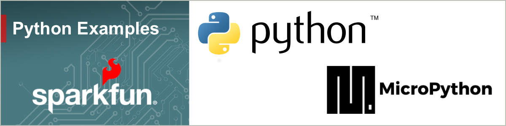

# SparkFun Python Examples

## SparkFun Qwiic

> [!NOTE]
> TODO: Overview and link to qwiic setup page

## Setup SparkFun Boards and Devices

> [!NOTE]
> TODO: Overview and link to setup page

## Examples

> [!NOTE]
> TODO: Overview and link to examples page
