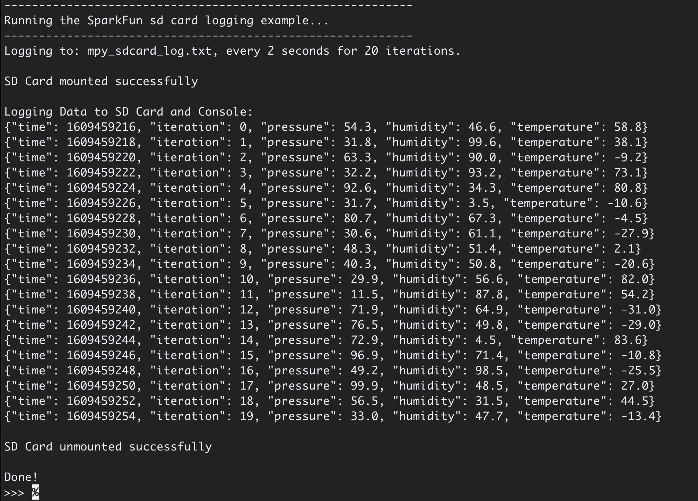

# MicroPython - Logging to a SD Card

Leveraging the flexibility of MicroPython, this example demonstrates how to access a SD Card, collect (simulated) sensor data efficiently and write the information in a JSON format to a file on the the system SD Card as well as print out the results to a connected serial console.

The key elements shown in this example include:

- Mounting the on-board SDCard and determining if a SD Card is inserted on the device
- Opening a file for writing on the SD Card
- Implementing a logging loop that orchestrates the recording and output of sensed information.
- Gathering sensor data in a python dictionary and writing this information in a JSON format.
- Detecting a board type at runtime.

## Requirements and Setup

### Supported Development Boards

Currently this example is setup to run on the following development boards running MicroPython:

- [SparkFun IoT RedBoard - RP2350](https://www.sparkfun.com/sparkfun-iot-redboard-rp2350.html)
- [SparkFun IoT RedBoard - ESP32 MicroPython](https://www.sparkfun.com/sparkfun-iot-redboard-esp32-micropython-development-board.html)
- [Teensy 4.1](https://www.sparkfun.com/teensy-4-1.html)

### SD Card

A FAT formatted SD card inserted into the Development Board.

A great option for this is the [1GB SD Card](https://www.sparkfun.com/microsd-card-1gb-class-4.html) at SparkFun.

## Install the Demo

The demo Python source code must be installed on the development board. This is either peformed using a MicroPython enabled IDE (such as [Thonny](https://thonny.org) or [PyCharm](https://www.jetbrains.com/pycharm/download/?section=mac)).

> [!NOTE]
> For development boards that access the SDCard via a SPI connection (such as the SparkFun Line of IoT RedBaords), the MicroPython `sdcard` library must be available. If not included in the MicroPython firmware, this library is easily installed using the MicroPython tool [mpremote](https://docs.micropython.org/en/latest/reference/mpremote.html).
>
> To install the library, connect your MicroPython development board to your computer and issue the following command in a terminal window:
>
> ```sh
>  mpremote mip install sdcard
> ```

## Running the Demo

Once the required demo files are loaded on the demo board, and a FAT formatted SDCard inserted, the demo is ready to run. To run the demo, connect to the development board and access the command line (often referred to as the [REPL](https://docs.micropython.org/en/latest/esp8266/tutorial/repl.html)). This is either done via an IDE interface, using the `mpremote` command or a Serial Terminal application.

Once at the REPL command line, the demo runs when the demo python file is loaded.

```python
>>> import mpy_sdcard_log
```

When the demo starts, the SD Card is mounted and the output file created. After this is complete, data is logged to the output file and to the console. The following is an example of the output:



Once the demo is complete, and while in the same MicroPython session, it is rerun using the following command:

```python
>>>> mpy_sdcard_log.run()
```
